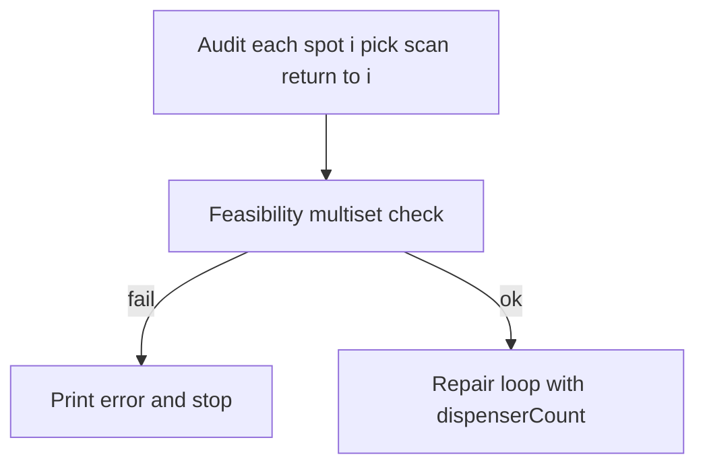

# Production ball-sorting sketch — refactor plan

## Source-of-truth files (already read)

| Role | Path |
|------|------|
| Requirements | [ball_sorting_project.md](c:/Users/JTerr/Downloads/ball_sorting_project.md) |
| Integrated sketch to refactor | [testfinal_code1.ino](c:/Users/JTerr/Downloads/testfinal_code1/testfinal_code1.ino) |
| Verified color pipeline | [working_photo_resistor_code.cpp](C:/Users/JTerr/OneDrive/School/Intro to Mechatronic design/Intro-to-Mech-Design/final-project/working_photo_resistor_code.cpp) |
| Movement/state-machine patterns | [working_arm_code_final.ino](C:/Users/JTerr/OneDrive/School/Intro to Mechatronic design/Intro-to-Mech-Design/final-project/working_arm_code_final/working_arm_code_final.ino) |

**Workspace note:** `ball_sorting_project.md` and `testfinal_code1.ino` live under Downloads; after implementation, copy the final `.ino` into your git repo (e.g. `Intro-to-Mech-Design/final-project/ball_sort_integrated/`) so it is version-controlled.

---

## Critical bugs / gaps in current integrated logic

### 1. Fixed mapping (must fix)

[`runAuditRepairCycle`](c:/Users/JTerr/Downloads/testfinal_code1/testfinal_code1.ino) uses:

- `correctSlot = (scannedColor == holder)` — treats **holder index** as Yellow/Green/Red/Blue.
- `searchDispenserForColor(holder)` — searches for **color index `holder`**, not `targetColor[holder]`.

Required behavior: **Spot `i`** (physical index 0–3) must match **`targetColor[i]`**, loaded from Serial (e.g. `BRYG` → spot0 Blue, spot1 Red, …).

### 2. Dispenser capacity (must fix)

Constraint from [ball_sorting_project.md](c:/Users/JTerr/Downloads/ball_sorting_project.md): dispenser never holds **more than four** balls; startup state is **four balls in dispenser + four in holder** ([ball_sorting_project.md](c:/Users/JTerr/Downloads/ball_sorting_project.md) lines 50–53)).

Current flow places wrong holder balls at `dispenserReturnPose` **during** the first loop without proving a slot was freed first — if each such placement adds to the dispenser stack, **the first “return wrong ball” risks overflowing from 4→5**.

**Design principle:** Maintain an explicit **`byte dispenserCount`** (0–4), updated only on operations that **pick from dispenser pickup** (−1) and **deposit at dispenser return** (+1). No deposit when `dispenserCount == 4` unless an algorithm step **first** removes one ball from the dispenser (pickup → scanned → staged elsewhere).

### 3. Audit phase should not corrupt inventory

Baseline intent: **know** each spot’s color without violating capacity.

- During **audit**, after `pick → sensor → scan`, **default safe restore** is **`moveBallFromSensorToPose(holderPose[i])`** so slot `i` still holds the same physical ball and `dispenserCount` stays 4 (unless you deliberately model an empty slot — not needed for counting multiset).

Separate **repair** moves then use tracked counts and staged swaps.

---

## Data model

### Color enum (as requested)

```cpp
enum Color : byte {
  COLOR_YELLOW = 0,
  COLOR_GREEN  = 1,
  COLOR_RED    = 2,
  COLOR_BLUE   = 3,
  COLOR_NONE   = 4,
  COLOR_UNKNOWN = 255
};
```

Map Serial characters `'Y','G','R','B'` ↔ `byte` 0–3. Reject anything else.

### Arrays (fixed size, SRAM-friendly)

- `byte targetColor[4]` — set by command `s`.
- `byte holderColor[4]` — filled by full audit (`COLOR_UNKNOWN` until scanned).
- `byte colorCount[4]` — total system count per color **Y/G/R/B** after full knowledge (see feasibility).
- `bool targetSet` — `r` refuses or warns if target not defined (your choice: require `s` before `r`).

### Naming / comments

Rename **logical** holder labels in Serial/calibration UI from “Yellow holder” to **Spot 1–4** (or 0–3). Physical pins `HOLDER_YELLOW` etc. in [testfinal_code1.ino](c:/Users/JTerr/Downloads/testfinal_code1/testfinal_code1.ino) are **positions**, not colors.

---

## Feasibility check (before repair)

After audit (and any defined rules for “known” dispenser composition at start), compute **multiset of all eight balls**:

- Initial guarantee: dispenser has **one of each** color ([ball_sorting_project.md](c:/Users/JTerr/Downloads/ball_sorting_project.md) lines 20–24).
- Holder multiset from `holderColor[0..3]` (ignore `COLOR_NONE` / failed reads as errors).

Target multiset: `targetColor[0..3]`.

**Necessary condition:** For each color `c`, `count_total[c] >= count_target[c]`. If not, print a **clear F() string** listing counts and **return** without motion (or park arm safe).

Optional stricter check: verify `sum(count_total) == 8` and all reads valid.

---

## Repair / sorting algorithm (high level)

Exact move sequences depend on **mechanical semantics** of `dispenserPickupPose` vs `dispenserReturnPose` (FIFO, LIFO, or “return re-enters tube”). The code must encode **one** consistent model:

1. **`pickDispenserBall()`** — `dispenserCount--` after successful pickup (and handle “no ball” / `COLOR_NONE`).
2. **`returnBallToDispenser()`** — allowed only if `dispenserCount < 4`; otherwise call a **`makeRoomInDispenser()`** routine that:
   - Picks one ball from dispenser (decrements count),
   - Scans it,
   - Places it in a **legal staging location** (empty holder slot, correct slot after another move, or explicit “parking” slot if hardware allows).

Because the machine has **only** four holder positions and **one** detector station, **`makeRoomInDispenser` is the highest-risk mechanical part**: the plan is to implement it as a **small explicit state machine** with comments tying each step to `dispenserCount` and ball location (holder vs sensor vs claw), and to add **Serial diagnostics** before/after each phase.

**Greedy strategy (outline):**

- Work from a full **mental model**: `dispenserCount`, `holderColor[]`, optional `detectorOccupied`.
- For each spot `i` in priority order (e.g. 0→3):
  - If `holderColor[i] == targetColor[i]`, skip.
  - Else: obtain `targetColor[i]` from dispenser using **bounded** `searchDispenserForColor(byte want, ...)` that:
    - Never returns a ball to dispenser when `dispenserCount == 4` without a paired **pull** (room-making step).
  - Evict wrong ball from spot `i` only when staging is valid.

If a **full** constrained planner is out of scope for one assignment, ship **(1)** safe audit + feasibility + **(2)** a **documented subset** of repair cases (e.g. only swaps that never need 5-ball dispenser) **or** **(3)** interactive operator prompts when the planner needs a manual shuffle — **only if** you prefer; default recommendation: implement **full automatic** room-making + staging as above.



---

## Preserve verified baselines

### Color / display / timing

From [working_photo_resistor_code.cpp](C:/Users/JTerr/OneDrive/School/Intro to Mechatronic design/Intro-to-Mech-Design/final-project/working_photo_resistor_code.cpp) and existing [testfinal_code1.ino](c:/Users/JTerr/Downloads/testfinal_code1/testfinal_code1.ino):

- Keep `readOne()` delays **300 / 100**, `avgRead()` 10×5 ms, **RGB pin order** (`G`,`R`,`B` pins 8,7,12 and `S` on A3), `bestMatch` / Euclidean distance on `saved[][]`, `REQUIRED_STABLE` gating in `scanStableColor()`.
- Keep 74HC595 segment patterns in `showColorLetter()`.

### Arm

- Keep integrated pin map **as in** [testfinal_code1.ino](c:/Users/JTerr/Downloads/testfinal_code1/testfinal_code1.ino) (do **not** copy [working_arm_code_final.ino](C:/Users/JTerr/OneDrive/School/Intro to Mechatronic design/Intro-to-Mech-Design/final-project/working_arm_code_final/working_arm_code_final.ino) pins — conflicts with shift register on pins 2–4).
- Optionally refactor **`moveToPose`** toward smoother stepping from working arm **without changing pins**, to reduce jerk; guard with `#define USE_SMOOTH_MOVE 1` if you want easy A/B.

---

## EEPROM

Extend [`CalibrationData`](c:/Users/JTerr/Downloads/testfinal_code1/testfinal_code1.ino) (currently magic `0xB011C0DE` at offset 0):

- Add **`uint8_t version`** (e.g. `2`) immediately after magic or in struct head.
- On load: if magic OK but version mismatch, **reject or migrate** (minimal: reject + prompt recalibrate).
- Persist **`targetColor[4]`** only if you want power-cycle recall (optional); default **volatile** until user runs `s`.

---

## Serial UX (required commands)

| Cmd | Action |
|-----|--------|
| `t` | Color calibration (existing flow; PROGMEM strings) |
| `a` | Arm calibration — label poses **Spot1..Spot4** not Y/G/R/B |
| `v` | Print calibration |
| `h` | Holder ADC values |
| `r` | Run audit + repair **only if** calibrated + arm OK + target set (recommended) |
| `p` | Print saved RGB calibration |
| `s` | Prompt: enter exactly four chars `Y/G/R/B`; validate; fill `targetColor[4]`; echo parsed sequence |
| `?` | Help menu listing above |

Implementation detail: For **`s`**, use a **blocking small state machine** in `loop()` or dedicated `readTargetSequence()`:

- Prompt once with `Serial.println(F("Enter desired..."))`
- Read into `char buf[8]` until `\n`, trim `\r`, verify length 4 and charset.

Avoid **`String`**.

---

## Code structure and Arduino IDE

- Single primary sketch folder; optional split: `config.h`, `colors.ino`, `arm.ino`, `eeprom_store.ino` — Arduino merges all `.ino` in folder (names affect build order alphabetically — use **prefixes** like `z_main.ino` last only if needed).
- **`Serial.read()` discipline**: flush trailing bytes after commands as today.

---

## Verification (when implementing — outside plan mode)

- Compile for **Arduino Uno**.
- Exercise: `s` → `RGBY`, audit-only path, feasibility fail case (constructed multiset), feasibility pass case.
- Log **`dispenserCount`** after each operation in `#ifdef DEBUG_SORT` builds.

---

## Deliverable

One merge-ready sketch directory containing the refactored `.ino`(s), **no blind pin changes**, baseline timings preserved, **`targetColor[4]`**-driven logic, **`dispenserCount`**-safe moves, multiset feasibility, and full Serial command table including **`s`** and **`?`**.
